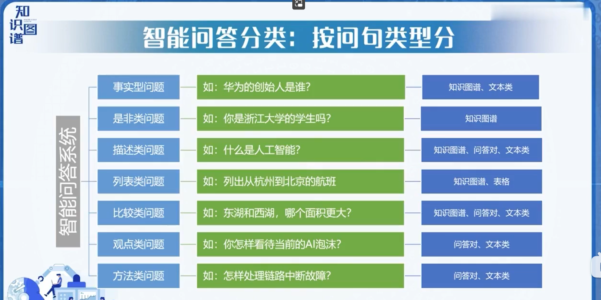
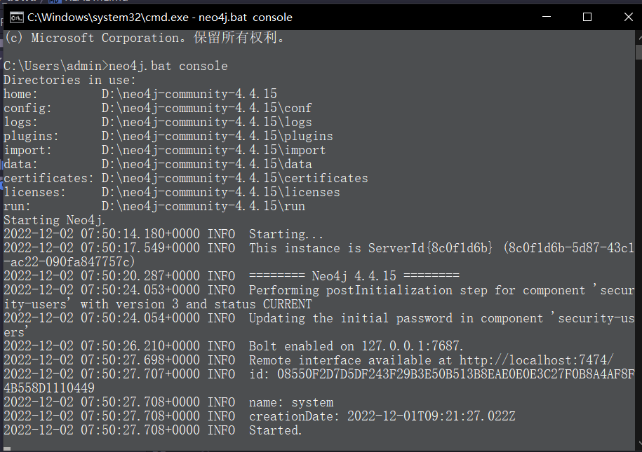

# ***问答精灵 - aowu***

---
### **题目编号:S3**
- 开发一个具有一定功能的小型问答系统，答案从给定的小型问答数据库中提取。

---
### **理论知识**

[教程资源-知识图谱导论-bilibili](https://www.bilibili.com/video/BV1pG4y1t7er?p=37&vd_source=0485bf51f6c5687165e39d63ac6bb095)

**什么是知识图谱？先摘一段百度百科：**

知识图谱（Knowledge Graph），在图书情报界称为知识域可视化或知识领域映射地图，是显示知识发展进程与结构关系的一系列各种不同的图形，用 可视化技术描述知识资源及其载体，挖掘、分析、 构建、绘制和显示知识及它们之间的相互联系。 知识图谱是通过将应用数学、 图形学、信息可视化技术、 信息科学等学科的理论与方法与计量学引文分析、共现分析等方法结合，并利用可视化的图谱形象地展示学科的核心结构、发展历史、 前沿领域以及整体知识架构达到多学科融合目的的现代理论。它能为学科研究提供切实的、有价值的参考。




**经验**
- 文本回答 + 知识图谱问答
- 视觉问答 + 知识图谱问答

**知识图谱问答评测数据集**
- QALD
  - 多语种问答
  - 基于链接数据问答
- WebQuestions
  - 6000+个问答对
- SimpleQuestions
  - 简单 常用数据集
  - 10W+个自然问题
- MetaQA
  - 垂直电影领域知识图谱
  - 40w+问题
- Others
    

---
### **neo4j使用简介**

neo4j下载链接：[neo4j download](https://neo4j.com/download-center/)

操作界面展示


启动命令-CMD命令行
```bash
$ neo4j.bat console
```



打开操作界面
```
浏览器输入 http://localhost:7474/
登录 - 初始用户：neo4j 初始密码：neo4j
目前 - 用户名：neo4j 密码：123456
```

neo4j使用-参考博客链接

[1. Neo4j 安装、使用教程](http://t.csdn.cn/M8w0j)

[2. neo4j新手教程](http://t.csdn.cn/vzbjO)

[3. 手把手教你快速入门知识图谱 - Neo4J教程](https://zhuanlan.zhihu.com/p/88745411?utm_source=wechat_session)

[4. Neo4j：入门基础（二）之导入CSV文件](http://t.csdn.cn/ARRFy)

python操作简介

``` python
from py2neo import Graph, Node, Relationship, NodeMatcher
import py2neo

g = Graph("http://localhost:7474/", user='neo4j', password='123456')
# 结点
test_node_1 = Node("Person", name='P1')
test_node_2 = Node("Person", name='P2')
# 添加属性
test_node_1['age'] = 18
test_node_1['sex'] = '男'
test_node_2['age'] = 19
test_node_2['sex'] = '女'
# 创建结点
g.create(test_node_1)
g.create(test_node_2)
# 创建覆盖式结点
g.merge(test_node_1, "Person", "name")
g.merge(test_node_2, "Person", "name")
# 创建关系
friend = Relationship(test_node_1, 'friend', test_node_2)
g.merge(friend, "Person", "name")
# 查询结点
matcher = NodeMatcher(g)
print(matcher.match("Person", name="P1").first())
```

建立图谱

```python
import csv
from py2neo import Graph, Node, Relationship, NodeMatcher
import py2neo

g = Graph("http://localhost:7474/", user='neo4j', password='123456')
with open('triples.csv', 'r', encoding='utf-8') as f:
    reader = csv.reader(f)
    for item in reader:
        if reader.line_num==1:
            continue
        print("当前行数", reader.line_num, "当前内容：", item)
        start_node = Node("Person", name=item[0])
        end_node = Node("Person", name=item[1])
        relation = Relationship(start_node, item[3], end_node)
        g.merge(start_node, "Person", "name")
        g.merge(end_node, "Person", "name")
        g.merge(relation, "Person", "name")
```

数据查询

```bash
$ MATCH (p: Person {name: "贾宝玉"})-[k: 丫鬟]-(r) return p,k,r
```

查询所有有关系的节点

```bash
$ MATCH (a)--() RETURN a
```

删除数据库中以往的图
```bash
$ MATCH (n) DETACH DELETE n
```

---
### **功能设计**
 
待完善


---
### **项目结构描述**

```
├─ README.md                     // 描述文件
├─ Core
│  ├─ create.py                 // 建立知识图谱与词表的程序文件
│  ├─ aowu_graph.py             // 聊天系统主函数
│  ├─ question_classifier.py    // 聊天系统问题分类函数 
│  ├─ question_parser.py        // 聊天系统问题转换函数 
│  ├─ answer_search.py          // 聊天系统问题回复函数
│  ├─ data_word
│  │  ├─ genre.txt             // 建立的种类词表 
│  │  ├─ movie.txt             // 建立的电影词表  
│  │  └─ person.txt            // 建立的词表  
│  └─ data_csv
│     ├─ genre.csv             // 图谱数据集之一
│     ├─ movie_to_genre.csv    // 图谱数据集之一
│     ├─ movie.csv             // 图谱数据集之一
│     ├─ person_to_movie.csv   // 图谱数据集之一
│     └─ person.csv            // 图谱数据集之一
├─ Crawler
│     └─ spider.py          // 爬虫程序
└─ Data
│  ├─ userdict3.txt         // 图谱数据集之一
│  ├─ vocabulary.txt        // 图谱数据集之一
│  └─ question              // 问题模版（项目中未用，但参考了）
│     └─ ...                // 16个问题模版
├─ image
├─ Plug_in
├─ Src
│  └── main.py                // 主函数
└─ Voice
   └── read.py                // 朗读函数

```

---
### **演示效果**

**开始界面**


---
### **总结**


---
### **参考链接**

[个人Github](https://github.com/)

---
